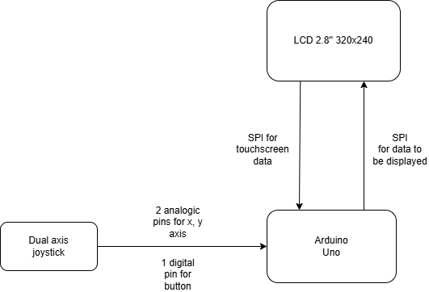
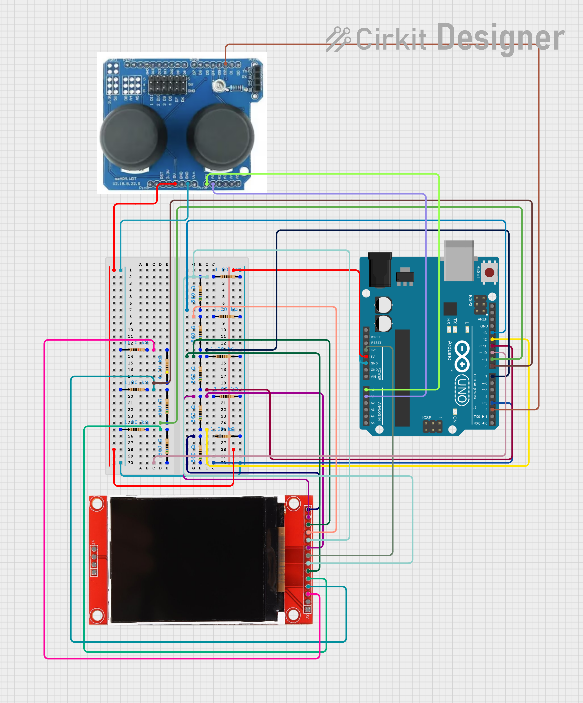
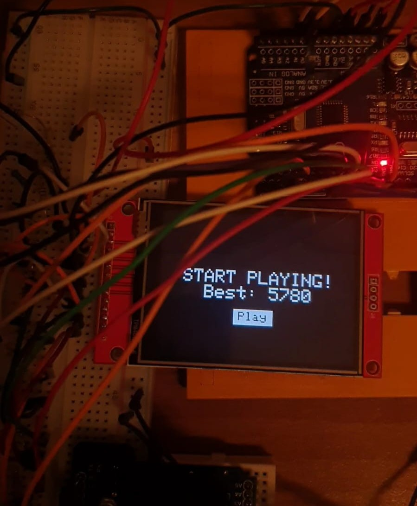
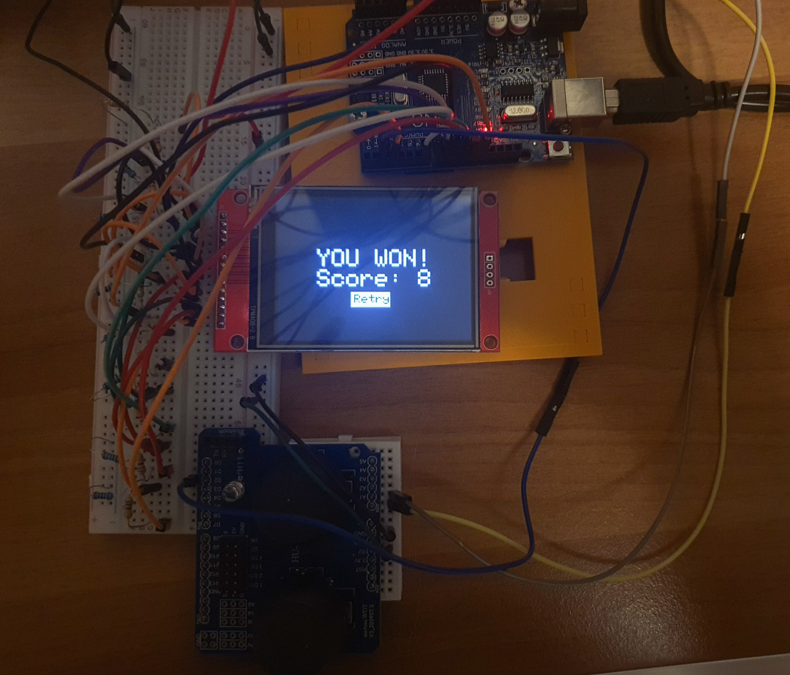

# 2048 on LCD Minigame

## Introduction
- This is a proposed implementation for the classic 2048 game using Arduino Uno and peripheral devices.

- **Purpose:**
  - For developers: Exercising basic concepts of programming microcontrollers.
  - For users: Entertainment.

- **Motivation:**
  - 2048 is my favorite arcade game as it needs the right combination of thinking and luck to make it entertaining enough to be relaxing while developing basic strategies.

- **Game functionalities:**
  - Classical 2048 game with score tracking, high score tracking, and GoBack option.

## Overview
The game will start with a simple hello menu. Then, the grid and score will be displayed on the LCD screen.

**User input:**
- Swipe on the touchscreen.
- Joystick movement.
- Joystick button push.

Any functionality of the game will be implemented both ways, either by interpreting screen touch or joystick input.

**Modules used:**
- Arduino Uno
- 2.8-inch, 320x240 LCD TFT touchscreen
- Dual-axis analog joystick

Components will be connected as shown in the block diagram:

## Hardware Design

### Electrical Scheme

The screen uses 3.3V for logical high while Arduino UNO uses 5V as pin output. Voltage dividers were added to prevent screen damage.

To obtain a good ratio, two pairs of resistors were used:
- 560Ω - 1kΩ
- 4.1kΩ - 10kΩ

### Pin Configurations

#### TFT Screen - Arduino
The Arduino SPI interface is shared between the display and touchscreen.

- **Power & Control Pins**
  - VCC - 5V
  - GND - GND
  - LED - 3.3V
  - CS - D8
  - RESET - D9

- **SPI Pins**
  - MOSI - D11 (shared)
  - SCK - D13 (shared)
  - MISO - D12 (shared, optional)

- **Touchscreen Pins**
  - T_CS - D7
  - T_CLK - D13 (shared)
  - T_DIN - D11 (shared)
  - T_DO - D12 (shared)
  - T_IRQ - D13

#### Dual-axis Joystick Module - Arduino
Only the left joystick is used, so only a few pins are connected.

- **Connections**
  - VCC - 5V
  - A0 (VRx) - A0
  - A1 (VRy) - A1
  - D2 (SW) - D2

### Bill of Materials
| Component        | Shop Link | Datasheet Link |
|-----------------|-----------|---------------|
| **TFT LCD 2.8"** | [eMAG Product Page](https://www.emag.ro/display-tactil-tft-lcd-2-8-inch-320x240-touchscreen-spi-driver-ili9341-arduino-emg561/pd/DSFJ88YBM/) | [Datasheet & Info](http://www.lcdwiki.com/2.8inch_SPI_Module_ILI9341_SKU:MSP2807) |
| **Arduino Uno** | [eMAG Product Page](https://www.emag.ro/placa-dezvoltare-arduino-uno-r3-compatibil-arduino-ide-atmega328-microcontroler-16-intrari-analogice-distanta-dintre-pini-2-54mm-i7/pd/DNS9R1YBM/) | [Datasheet](https://www.alldatasheet.com/datasheet-pdf/view/1943445/ARDUINO/ARDUINO-UNO.html) |
| **Joystick Module** | [eMAG Product Page](https://www.emag.ro/modul-joystick-compatibil-cu-arduino-uno-3874784221527/pd/D48GB9YBM/?ref=hdr-favorite_products) | [Datasheet](https://components101.com/modules/joystick-module) |
| **Resistors** | [eMAG Product Page](https://www.emag.ro/set-600pcs-rezistente-0-25w-30-tipuri-toleranta-1-20-de-bucati-pentru-fiecare-valoare-ideal-pentru-proiecte-electronice-si-ingineri-include-rezistente-10-100-1k-10k-100k-pana-la-1m-utilizat-pentru-pro/pd/DBV351YBM/) | [Datasheet](https://assets.rs-online.com/v1699613067/Datasheets/7ec977c91977fd4e95a020bd86d6d6c5.pdf) |

## Software Design

### External libraries used
- `Adafruit_GFX.h`
  - used for TFT display rendering (text, rectangles, fill background, etc)
- `Adafruit_ILI9341.h`
  - used for communicating with the TFT display over SPI
- `XPT2046_Touchscreen`
  - used for interfacing with the resistive touchscreen overlay
- `EEPROM.h`
  - used for accessing non-volatile memory in order to store the best score
- `avr/sleep.h`
  - used for delaying rapid changes in order to avoid overriding of actions

### Code components
Code splits itself into two main components:
- **Interfacing with the hardware**, where the first three libraries above work as convenient wrappers. This includes:
  - Functions that display menus
  - Functions that display the grid
  - Functions that interpret swipes or button pushes
- **Keeping track internally of the current game state**, which includes:
  - Updating code flags to keep track of game state (identifying current menu)
  - Updating inner structures according to performed moves
  - Updating inner structure of past moves and best score altogether

### Game flow
1. A starting menu is displayed, and on button press, the game starts.
2. While playing, possible moves are `LEFT`, `RIGHT`, `UP`, and `DOWN`, depending on the direction the grid changes.
3. If a tile with value `2048` is reached, the game is considered won, and a win screen is displayed.
   - Best score is updated if necessary, and a new game can be started on button push.
4. If no more possible moves are available (grid is full and no tiles can coalesce anymore), the game is considered lost.
   - Best score is updated, and a lose screen is displayed.
   - However, the user can perform an `Undo`, which might allow continued play if a convenient tile is generated.
5. At any point in the game, **3 undos** are possible. If more are requested, the state does not change.
6. On every move, if the grid has changed, a new tile appears in a random position.
   - If the grid **does not change**, **no tile** is added to avoid fake moves.

### Implementation details
- Value of new tiles is either `2` or `4`, but they are added with different probabilities:
  - `2` appears in 8 out of 10 cases, while `4` appears otherwise.
  - This ensures a longer game but may require more trials when performing an undo if the game was lost.
- The `random()` function is used to generate both tile values and tile positions.
  - Tile position is randomly chosen from the list of free positions.
  - At game start, `randomSeed` is initialized with an analog value from a floating pin to avoid predictability.
- The `XPT2046` does not return pixel coordinates of touch.
  - Thus, remapping using `map` was needed to convert the scale from `(0, 4095)` to screen pixel dimensions.
- For cleaner code, a `Grid` class was implemented as a wrapper over a simple 4x4 matrix.
  - This way, the overloaded `==` operator and copy constructor made saving states for undos and performing undo moves easier.

### Control options
The user can choose to use **touchscreen** or **joystick**.

- In the loop function, both variants are polled. Interrupts could not be used because the ISR function would have been too complex. Thus, a polling approach was chosen, considering that playing involves continuous moves.
- On menu changes, two flags are implied:
  - One that is set the first time the menu needs to be displayed.
  - One that is set the whole time the menu is displayed.
  - This implements **debouncing** and optimizes screen rendering operations.

### Optimizations
- As mentioned above, rerendering is avoided as much as possible.
  - When the screen changes, tiles are rendered only if they have different values than before.
- When rendering tiles, colors are chosen based on their value.
  - To perform this efficiently, **ILI9341-provided colors** are stored in an array, and bitwise division is used to find `idx = log2(val)`.
- `EEPROM.update` is used instead of `EEPROM.write` to preserve non-volatile memory lifetime.

### Used labs
- **Lab0: GPIO** - for joystick button
- **Lab4: ADC**
  - `Arduino` uses a 10-bit ADC to map analog read values from pins used for joystick's Vrx and Vry between 0 and 1023.
  - `XPT2046` touchscreen controller uses a 12-bit ADC to convert measured voltage to a value between 0 - 4095.
- **Lab5: SPI**
  - SPI protocol is used to communicate with the display (both for rendering and getting touchscreen input).
- **Lab1: USART**
  - Used for debugging code.

### Results
[GitHub repository](https://github.com/marinaoprea/2048_Arduino_minigame)

[Demo video](https://drive.google.com/file/d/1MYe3Vqu2S6hLiaHRXt_nY94sQPNRhBG9/view?usp=sharing)

### Conclusions
This project was a good opportunity to see how theoretical concepts work in real-life applications, helping create something entertaining.

### Bibliography & Other materials
- [Display interfacing](https://forum.arduino.cc/t/interfacing-arduino-with-ili9341-color-tft-display/1226327)
- [Interrupts discussions](https://forum.arduino.cc/t/interrupts-and-tft/325116/35)
- [Resistor color code calculator](https://www.digikey.com/en/resources/conversion-calculators/conversion-calculator-resistor-color-code)
- [Arduino electrical scheme designer](https://app.cirkitdesigner.com/project)
